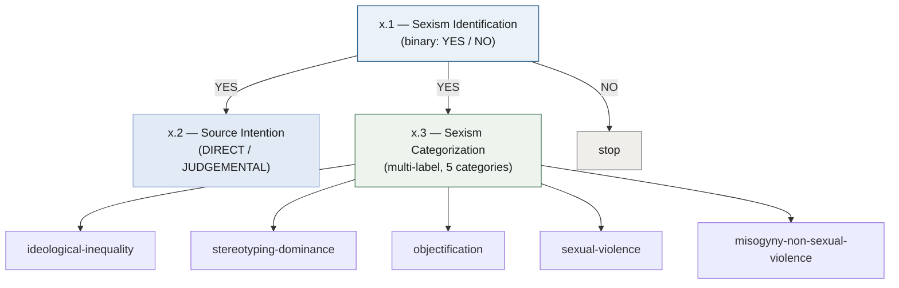
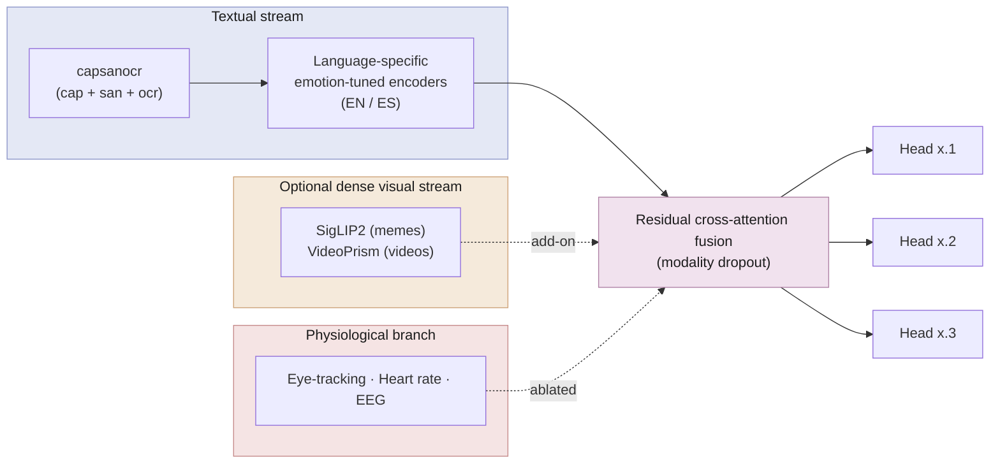
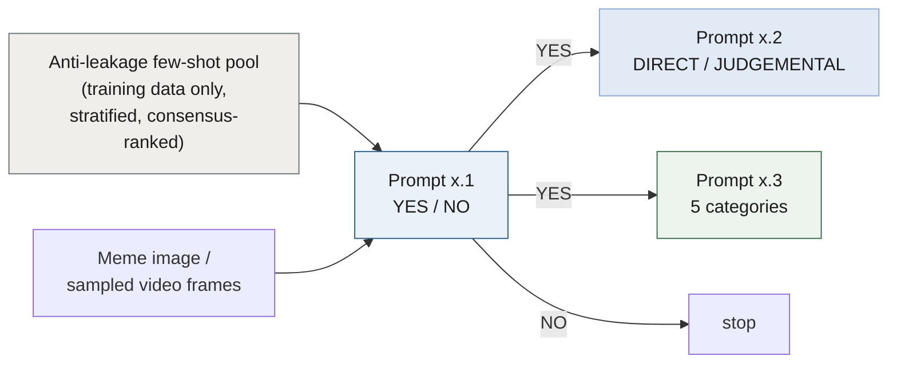

<div align="center">

# ELiRF-UPV at EXIST 2026

### Multimodal Fusion and Few-Shot LLMs for Sexism Detection in Memes and Videos

*CLEF 2026 — EXIST Lab · Tasks 2 (Memes) & 3 (TikTok Videos)*

[](https://clef2026.clef-initiative.eu/)
[](http://nlp.uned.es/exist2026/)
[]()
[]()
[](https://creativecommons.org/licenses/by/4.0/)

</div>

---

## 📌 Overview

This repository accompanies the working-notes paper of the **ELiRF-UPV** team for the
**EXIST 2026** shared task at CLEF 2026. We tackle all **six subtasks** of sexism
detection over two modalities — **memes (Task 2)** and **short TikTok videos (Task 3)** —
under the *Learning with Disagreements* (LeWiDi) paradigm, where systems are rewarded
for matching the full **annotator-disagreement distribution** rather than a single hard label.

Everything is evaluated with **PyEvALL** using **ICM** / **F1** in the *hard–hard* setting
and the primary **ICM-Soft** metric in the *soft–soft* setting.

We contribute **two complementary system families**, both applied to memes *and* videos,
and both built on a shared idea: enriching the on-screen text with a **neutral VLM visual
description** and an **independent gender-relevance analysis** to avoid confirmatory bias.

---

## 🧩 The Six Subtasks

Tasks 2 and 3 share the same three-subtask structure. The hierarchy is enforced at
**evaluation time** by PyEvALL, not during training.



| Subtask | Name | Output |
|--------|------|--------|
| **x.1** | Sexism identification | `YES` / `NO` |
| **x.2** | Source intention | `DIRECT` / `JUDGEMENTAL` |
| **x.3** | Sexism categorization | multi-label over 5 categories |

---

## 🖼️ The `capsanocr` Enriched View

The shared textual backbone of both systems is an enriched view of each instance,
denoted **`capsanocr`** — the concatenation (with `[SEP]`, always in the instance's
language) of three complementary sources:

| Token | Source | What it captures |
|-------|--------|------------------|
| **`cap`** | Qwen3-VL-8B | A *neutral visual description* of what the content depicts (people, gestures, setting) without judging it. |
| **`san`** | Qwen3-VL-8B | An *independent gender-relevance analysis*, generated by a **separate** prompt, reasoning about whether/how the content relates to sexism. |
| **`ocr`** | dataset | The literal *on-screen text* — meme overlay text (Task 2) or transcription + on-screen text (Task 3). |

> Generating the description and the analysis with **two separate prompts** keeps the
> sexism reasoning apart from the final decision, mitigating confirmatory bias. The idea
> of VLM-derived enrichment follows **Arcos et al. (2026)**; the per-language two-prompt
> construction and the `capsanocr` naming are our contribution.

---

## ⚙️ System A — PhysioMeme-Fusion *(trained)*

A trained multimodal system with **three per-subtask heads optimized directly on soft
labels** (KL divergence for mono-label heads, BCE for multi-label categorization), each
with an explicit `No` class so the soft metric drives learning.



- **Core:** per-language emotion-tuned encoders over the `capsanocr` view.
- **Physiological branch:** encodes the eye-tracking, heart-rate and EEG signals released
  for the lab subjects (each stimulus seen by only 2–4 subjects → must tolerate missing
  modalities). Used as content-level evidence, *ablated* rather than assumed.
- **Optional dense visual stream:** SigLIP2 (memes) / VideoPrism (videos) as an add-on
  measured against the text-only core.

---

## 🤖 System B — Few-Shot Cascade *(training-free)*

A **training-free** pipeline that prompts open-weight multimodal LLMs in a hierarchical
cascade, passing meme images or sampled video frames directly alongside the released text.



- **Backends:** `Qwen3.5-27B` and `Gemma-4-31B-it`, toggled by a single switch, greedy
  decoding (`do_sample=False`) for deterministic runs — one pipeline, unchanged across
  both modalities and both architectures.
- **Few-shot pool:** built only from the **training** partition (prevents leakage),
  mirrors the cascade, ranks candidates by annotator consensus, and excludes `No` from
  the x.2 / x.3 pools.

---

## 📊 Headline Results

| Finding | Detail |
|--------|--------|
| 🥇 **Few-shot pipeline is the strongest system** | Under *hard–hard* it is competitive across both modalities — **1st on video identification** and **3rd on meme categorization** — showing a definition-rich hierarchical prompt is a powerful, **data-free** baseline. |
| 📝 **The enriched textual view carries System A** | The `capsanocr` view (building on Arcos et al.'s enrichment) does the heavy lifting on the trained side. |
| 🧠 **Physiological branch: honest null result** | No soft-metric gain (occasionally detrimental on fine-grained categorization) — reported as a valid scientific finding. |
| 👁️ **Dense visual stream is redundant** | Degrades performance wherever the verbalized view is already present. |

> Full results tables (soft–soft and hard–hard, with ordinal rank superscripts) are in the paper.

---

## 🗂️ Repository Structure

> ⏳ **The code, prompts, notebooks and configurations will be added to this repository.**
> The planned layout is:

```
EXIST-2026/
├── prompts/              # Verbatim system prompts (System B), shared by both backends
│   ├── memes/            # T2.1, T2.2, T2.3
│   └── videos/           # T3.1, T3.2, T3.3
├── notebooks/            # End-to-end notebooks for both system families
│   ├── system_a/         # PhysioMeme-Fusion: training, fusion, ablations
│   └── system_b/         # Few-shot cascade: Qwen 3.5 / Gemma 4
├── configs/              # Full configurations + hyperparameter settings
├── fewshot_pools/        # Cached, anti-leakage exemplar pools (training-only)
└── README.md
```

---

## 🧪 Evaluation

- **Framework:** [PyEvALL](https://github.com/UNEDLENAR/PyEvALL)
- **Primary metric:** **ICM-Soft** (information-theoretic, distribution-matching)
- **Secondary:** ICM, normalized ICM, F1 (hard–hard)
- **Hierarchy:** enforced at evaluation time via `PARAM_HIERARCHY`, keeping per-subtask
  heads decoupled.

---

## 📦 Dataset

The bilingual (EN/ES) EXIST 2026 corpus re-annotates earlier editions within a
human-centered framework:

| Modality | Train | Test | Annotators |
|----------|------:|-----:|:----------:|
| Memes (Task 2)  | 3,984 | 1,053 | 6 |
| Videos (Task 3) | 2,524 |   674 | 3 |

A separate pool of lab subjects additionally provides **physiological recordings**
(eye-tracking, heart rate, EEG — 16-channel 10–20 montage), each stimulus seen by only
2–4 subjects. *(Data is distributed by the EXIST organizers and is not redistributed here.)*

---

## 📖 Citation

If you use this work, please cite:

```bibtex
@inproceedings{garciareal2026elirf,
  title     = {{ELiRF-UPV at EXIST 2026: Multimodal Fusion and Few-Shot LLMs
               for Sexism Detection in Memes and Videos}},
  author    = {Garc{\'i}a-Real, Juan Alfonso and Ahuir, Vicent and
               Castro-Bleda, Mar{\'i}a Jos{\'e}},
  booktitle = {Working Notes of CLEF 2026 -- Conference and Labs of the
               Evaluation Forum},
  year      = {2026},
  address   = {Jena, Germany}
}
```

---

## 👥 Authors

**ELiRF Research Group · VRAIN · Universitat Politècnica de València**

- **Juan Alfonso García-Real** — `jagarrea@etsinf.upv.es` *(corresponding author)*
- **Vicent Ahuir** — `vahuir@upv.es`
- **María José Castro-Bleda** — `mcastro@dsic.upv.es`

---

<div align="center">

📄 Released under [CC BY 4.0](https://creativecommons.org/licenses/by/4.0/) ·
🏛️ ELiRF-UPV / VRAIN / ValgrAI

</div>
